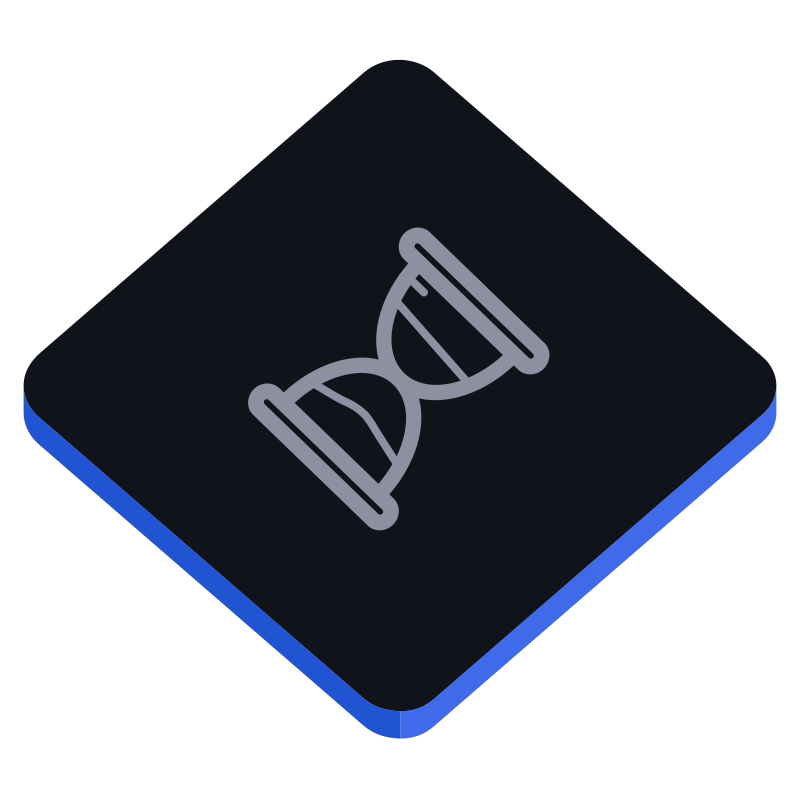

# Mercury - Time Tracking System



Mercury is a time tracking platform built with:
- Node.js + Express backend
- Admin Web Application (Web Components)
- Local Installable Employee PWA (Web Components)

---

## Project Structure

| Folder | Description |
|--------|-------------|
| `/backend` | Node.js Express API server |
| `/webapp` | Admin web app to manage employees, projects, and tasks |
| `/localapp` | Employee PWA for time tracking and screenshots |

---

## Backend - Express API (these are some of the many APIs)

| Method | Endpoint | Description |
|--------|----------|-------------|
| POST | `/admin/login` | Authenticate admin user |
| POST | `/invite/send` | Send invite email to employee |
| GET | `/employee` | Fetch all employees (optional select fields) |
| POST | `/employee` | Add new employee |
| GET | `/employee/:id` | Fetch employee by ID |
| POST | `/employee/login` | Employee login (accept invitation) |
| GET | `/project` | Fetch all projects |
| POST | `/project` | Create a new project |
| GET | `/project/:id` | Fetch project by ID |
| POST | `/task` | Create a new task |
| GET | `/task/:id` | Fetch task by ID |
| GET | `/task` | Fetch all tasks |
| POST | `/analytics/window` | Post time tracking entry (with background info) |
| POST | `/analytics/project-time` | Post or update total project time |
| GET | `/analytics/project-time` | Get project time records (filter by employeeId/projectId) |
| POST | `/screenshot` | Post screenshot metadata |
| GET | `/screenshot` | Get screenshots (filter by employeeId/projectId) |
| POST | `/upload` | Upload screenshot image |
| GET | `/auth/validate` | Validate current token for admin or employee |

---

## Admin Web App

The Admin Web App provides functionality to:
- Login as Admin
- Add employees, projects, tasks
- View and manage employees and projects
- Send email invitations to employees
- View time logs and screenshots

Built using Web Components (framework independent and using web standards, compatible with any framework).

---

## Local App (PWA for Employees)

The Local App (PWA) allows employees to:
- Accept invitations from email link
- Install the app on desktop Chrome
- Clock in and out
- Auto-log time sessions and screenshots
- Work offline (Progressive Web App)

Built using Web Components and optimized for `display-mode: standalone`.

---

## PWA Features

| Feature | Status |
|---------|--------|
| Manifest.json | Included |
| Service Worker | Included (basic offline caching) |
| Installation Prompt | Guided setup |
| Works Offline | Yes |
| Native PWA Behavior | Yes |

---

## Getting Started

1. Clone the repository.
2. Run backend server:
   ```bash
   cd backend
   npm install
   npm run dev
   ```
3. Open the Admin Web App in a browser.
4. Open the Local App (PWA) to accept employee invites.

Make sure to update `.env` files with mail credentials and JWT secrets before running.

---

## Technologies Used

| Area | Stack |
|------|-------|
| Backend | Node.js, Express, Nodemailer |
| Frontend | HTML5, CSS5, Web Components, Vanilla JS |
| PWA | Service Worker, Manifest.json, Cache API |

---

> [!NOTE] 
> - Admin tokens are securely stored in localStorage after login.
> - Employees accept invite links and log in through the PWA.
> - Web Components are used throughout for a modular, framework-free frontend.
> - Chrome Desktop is the primary supported platform for optimal PWA behavior.
